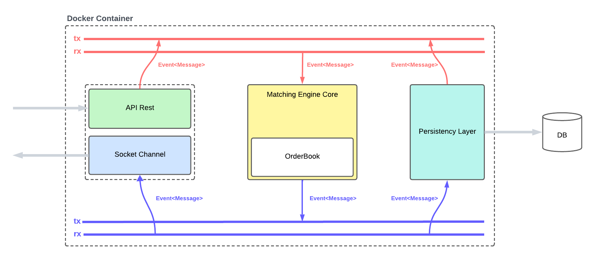
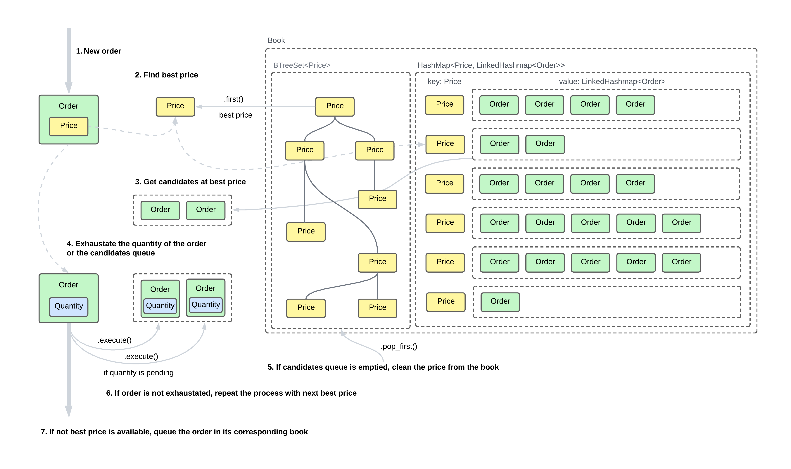

# MATCH CORE

This project implements a **centralized matching engine**, the fundamental component at the core of any trading platform or electronic exchange. A matching engine is responsible for receiving buy and sell orders from multiple clients, storing them in an order book, and continuously matching compatible orders to generate trades. In practice, this is the same mechanism that powers real-world exchanges such as Binance or Coinbase: every time a trader places a limit or market order, the matching engine determines if there is a counterpart order available and executes the transaction. Queuing those that aren’t matched at the moment they are placed.

Our implementation is written in **Rust**, leveraging its safety guarantees and concurrency model to deliver **low latency, high throughput, and fault-tolerant order processing**. It is designed as a self-contained service that can run as a microservice in any system.

## Key Features

- **Order Handling:** supports limit and market orders.
- **Order Book:** efficient in-memory data structures for fast lookups and matching.
- **Matching Logic:** automatically executes trades when bid/ask prices overlap.
- **Persistence:** snapshots of the order book can be stored and restored from disk.
- **Resilience:** recovery after restarts or crashes.
- **Real-Time-Updates:** clients receive live notifications of book updates and trades via WebSocket.
- **Concurrency:** built with Rust’s async runtime to handle multiple clients safely and efficiently.

## Architecture Overview

This matching engine is built with a strong focus on efficiency, parallelism, and safety. To achieve these goals, each engine instance is designed to handle a `single trading pair independently`. This isolation minimizes contingencies between markets and allows the system to scale horizontally.
If bidirectional or cross-pair trading is required (for example, `USD/EUR` and `EUR/USD`), separated instances can be deployed — for instance, as two distinct Docker containers — each dedicated to one direction of the market.



To maximize parallelism and minimize thread blocking and bottlenecks, the engine follows a layered threads design. Each layer handles a specific stage of order processing, with minimal synchronization and communication between threads. This approach ensures that threads can operate concurrently with minimal interruptions, improving throughput and overall system efficiency.

- **Server Layer:** server for client connections. It does include a minimal API rest to manage orders and a socket channel to be updated with the order book changes.
- **Matching Engine Core:** the heart of the system, where the order book exists and the trades are created through matching orders.
- **Event System:** two **mspc** channels connect the execution threads and keep the paralellism efficient. The <span style="color:#f57751;">red channel</span> allows the connection to the engine while the <span style="color:#5951f5;">blue channel</span> helps the enginee to broadcast the changes.
The mpsc channels will act as FIFO queues. This way, when the matching engine is busy and cannot process an incoming order, that order will wait in the queue until it is executed.
- **Persistency Layer:** stores the orders and trades. It also in charge to create snapshots of the orderbook for recovery.

### Data Structure

The matching engine uses a **hybrid structure** that combines hashmaps and binary heaps to efficiently manage and match orders.

````
pub type OrderQueue = LinkedHashmap<Order>;
pub type OrderMap = HashMap<Price, OrderQueue>;
pub type BidQueue = BTreeSet<Reverse<Price>>; // Ordered greatest to smallest
pub type AskQueue = BTreeSet<Price>; // Ordered smallest to greatest


pub struct OrderBook {
    bids: OrderMap,
    asks: OrderMap,
    bids_queue: BidQueue,
    asks_queue: AskQueue,
}
````

- `OrderQueue`:
Stores Order in a `LinkedHashmap<Order>`, a custom data structure defined to ensure FIFO access with efficient operations.
- `OrderMap` (`HashMap<Price, OrderQueue>`)
Each price level maps to a queue of orders (`OrderQueue`), stored as a stack (`LinkedHashmap<Order>`) sorted in a FIFO model (older orders have higher priority).
    - `bids`:
    contains buy orders grouped by price.
    - `asks`:
    contains sell orders grouped by price.
- `BidQueue` and `AskQueue`:
These `BTreeSet<Price>` maintain the set of active price levels, enabling quick access to the best bid (highest price) and best ask (lowest price).
    - `BidQueue`:
Prices for placed bids are uniquely stored in a descending order in a `BTreeSet<Price>` structure.
    - `AskQueue`:
Prices for placed asks are uniquely stored in an ascending order in a `BTreeSet<Reverse<Price>>` structure.


This structure optimizes for fast price-level access and priority matching:
Using HashMaps allows constant-time lookup of existing price levels and ensures insertion/removal while maintaining order priority. Keeping separate global BTreeSet for prices (BidQueue, AskQueue) avoids scanning all price levels to find the best price — crucial for real-time matching performance.

This design balances speed, simplicity, and memory efficiency, and scales well under high-frequency trading workloads.

### LinkedHashmap

This custom data structure has been implemented to optimize the matching process. It does works as a LinkedList. It does contains each value into a Node double-linked to its previous and next sibling. These `prev` and `next` links keep the orders sorted by placed time for each of the prices available.

LinkedHashmap<T> is a hybrid data structure that combines the fast lookups of a HashMap with the ordered traversal of a doubly linked list.
It maintains **FIFO** (insertion) order while providing O(1) access, insertion, and removal by key.

- `head` → ID of the first (oldest) element
- `tail` → ID of the last (newest) element
- `items` → hashmap for O(1) access by ID

This makes LinkedHashmap ideal for systems like order books, LRU caches, or task queues where both ordering and fast random access are required.

It does follow this simplified structure and interface:

````
pub trait HasId {
    type Id: Eq + Hash + Clone;
    fn id(&self) -> Self::Id;
}

struct Node<T: HasId> {
    pub value: T,
    pub next: Option<T::Id>,
    pub prev: Option<T::Id>,
}

pub struct LinkedHashmap<T: HasId> {
    head: Option<T::Id>,
    tail: Option<T::Id>,
    items: HashMap<T::Id, Node<T>>,
}
    pub fn new() -> Self {}

    pub fn push(&mut self, value: T) {}

    pub fn push_first(&mut self, value: T) {}

    pub fn pop(&mut self) -> Option<T> {}

    pub fn remove(&mut self, id: &T::Id) -> Option<T> {}

    pub fn peek(&self) -> Option<&T> {}

    pub fn peek_tail(&self) -> Option<&T> {}

    pub fn get(&self, id: &T::Id) -> Option<&T> {}

    pub fn get_mut(&mut self, id: &T::Id) -> Option<&mut T> {}

    pub fn len(&self) -> usize {}

    pub fn is_empty(&self) -> bool {}

    pub fn contains(&self, id: &T::Id) -> bool {}

    pub fn clear(&mut self) {}
````

##### Operation costs table:

| Method | Description | Complexity (Big O) |
| ------ | ----------- | ------------------ |
| `push` | Insert element at the end | O(1) |
| `push_first` | Insert element at the front | O(1) |
| `pop` | Remove element from the head | O(1) |
| `remove` | Remove element by ID | O(1) |
| `peek` / `peek_tail` | Access first / last element | O(1) |
| `get` / `get_mut` | Access element by ID | O(1) |
| `contains` | Check if ID exists | O(1) |
| `len` / `is_empty` | Size or emptiness check | O(1) |
| `clear` | Remove all elements | O(n) |

### OrderBook

Engine runs an orderbook in memory to allow matching as fast and safe and possible. To achieve this efficiency, it does implement our `LinkedHashmap`internally.

- `bids` / `asks` → map price levels to queues of orders (OrderQueue = LinkedHashmap<Order>)
- `bids_queue` / `asks_queue` → maintain sorted price levels for fast best-price access

````
pub struct OrderBook {
    bids: HashMap<Price, OrderQueue>,
    asks: HashMap<Price, OrderQueue>,
    bids_queue: BTreeSet<Reverse<Price>>, // descending order
    asks_queue: BTreeSet<Price>,          // ascending order
}
impl OrderBook {
    pub fn execute(&mut self, mut order: Order) -> Vec<Trade> {}
    
    pub fn cancel(&mut self, order: Order) {}
}
````

### Matching orders flow

The following diagram shows the flow to match an entry order:




##### Operation costs table:

| Method | Description | Complexity (Big O) |
| ------ | ----------- | ------------------ |
| `execute` | Match an incoming order against existing ones | O(n + k·log p) worst case, O(1) best case |
| `cancel` | Remove an existing order by ID and price | O(1 + log p) |

**Where:**
- n = total number of orders in the book
- k = number of price levels touched during execution
- p = total number of price levels in the BTreeSet


## Development 

### Dependencies

- **axum:** Web framework for building HTTP servers and WebSocket endpoints; handles routing, extractors, and middleware.
- **tokio:** Asynchronous runtime for handling multiple concurrent tasks efficiently, including WebSocket connections.
- **serde:** Serialization/deserialization library; allows converting Rust structs to JSON and back.
- **serde_json:** JSON support for serde, enabling sending/receiving JSON messages over WebSocket.
- **dashmap:** Thread-safe concurrent hashmap, useful for managing connected clients without locking the entire structure.
- **tracing:** Structured logging library to track events, useful for debugging and monitoring.
- **tracing-subscriber:** Subscriber implementation for tracing to collect and format logs.
- **anyhow:** Simple error handling library for Rust; allows returning and propagating errors easily.
- **bincode:** Efficient binary serialization library, useful for saving/loading snapshots of the order book quickly.

### Commands

#### Install dependencies

````
cargo install cargo-watch
cargo install --path .
````

#### Start development mode

````
cargo watch -x run
````

#### Start testing mode

````
cargo watch -x test
````

